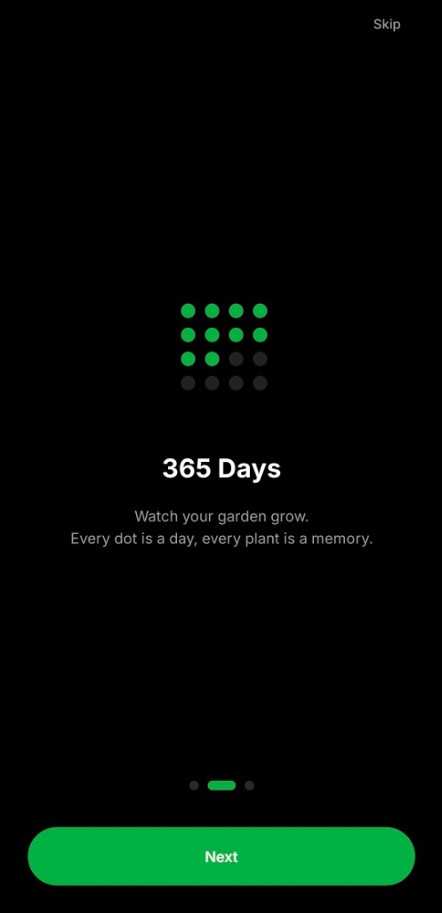
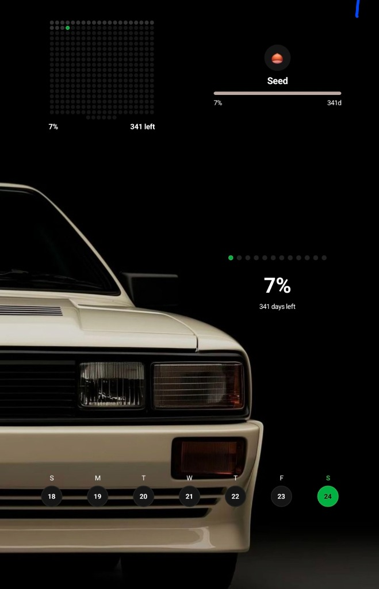

# 365: Year Progression & Journaling

**365** is a minimalist React Native application designed to help you visualize your year, build consistent habits, and cultivate memories.



## 📌 Features

- **Year Visualization**: See your year as a grid of days. Every dot is a day.
- **Daily Journaling**: "Every plant is a memory." Select a plant emoji to represent your day.
- **Garden Growth**: Watch your garden grow as you log entries.
- **Home Screen Widgets**: Keep track of your progress directly from your home screen with beautiful, transparent widgets.
- **Local First**: Your data stays on your device.

## 📱 Screenshots

### Onboarding Flow
| Splash | Streak | Plant Selection |
|:---:|:---:|:---:|
|  |  |  |

### App Experience
| Main Screen | Widgets |
|:---:|:---:|
|  |  |

## 🧩 Widgets

Stay connected to your progress with our custom widgets:
- **Year Grid**: A compact 2x2 grid showing every day of the year.
- **Plant Growth**: Visual representation of your current progress (Seed -> Tree).
- **Quotes & Stats**: Daily motivation.

## 🛠 Tech Stack

- **React Native** (Expo)
- **TypeScript**
- **React Native Android Widget**
- **AsyncStorage**

## 🚀 Getting Started

1. **Clone the repository**
   ```bash
   git clone https://github.com/b-aragu/365.git
   ```

2. **Install dependencies**
   ```bash
   cd 365
   npm install
   ```

3. **Run on Android**
   ```bash
   npm run android
   ```
